# Icon-Bingo-Generator

Multi-mode bingo generator with icon support

## Instructions

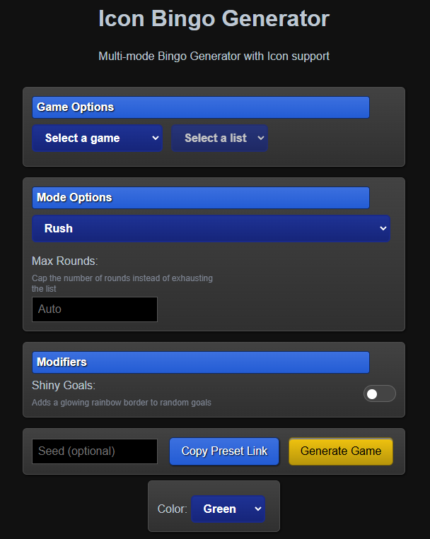

**How to Play**

1. Select a game, then select an objective list from the dropdown menus
   - Some lists have filter tags. If you uncheck them, objectives with that tag won't show up on the board.
   - "List Preview" will appear when a list is selected, showing how many objectives are in the list and how many have icons
2. Select a bingo mode and set applicable options
3. (Optional) Enter a seed
4. Click "Generate Game" to generate a game board.
5. A random seed will be generated if you didn't enter a seed, otherwise the seed you entered will be displayed as the current seed.
   - "Copy Board Link" will save the link to the board to your clipboard to save or share with others. (The address bar in your browser is the same link as "Copy Board Link".)
   - "Copy Preset Link" will save the game, settings, and seed (if generated) to your clipboard to save or share with others.
6. The board is initially hidden. Click to reveal it.

**Controls**

- Left click - Mark square as Completed (fills with your color)
- Right Click - Border-mark a square (outlines with your color)
- Scroll Wheel - Cycle: Default > Border-marked > Completed
- Hotkeys: 1, 2, 3 - Mark square as Completed (Rush Mode Only)

**Other**

- Color dropdown selects your marking color. It will automatically update if changed mid-game.
- The "Icons" toggle switches between showing icons and text for objectives.
- The "Wheel Mode" toggle switches the function of the Scroll Wheel between marking squares and incrementing/decrementing a counter on squares.
- The "Reset" button in the top left corner of the generator page will reset the page to default.
- The "Back" button in the top left corner of the game board page will send you back to the generator page.

For using your own list, see the "Custom Bingo Lists" section.

## Overview of Features

Full bingo lists: https://cj-2123.github.io/docs/bingo.html

### Bingo Board Types

#### Rush

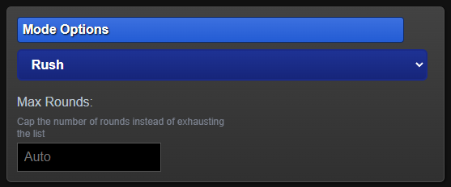

Complete 1 of 3 goals given to you. After completing a goal, 3 more goals appear.

- The goal you chose and the 2 goals you didn't choose will not show up again.
- If there are less than 3 goals left, the final 1 or 2 will be shown.
- "Max Rounds" determines how many rounds you will play. The default is to play until the entire objective list shows up.
- Score keeps track of how many rounds you've completed.
- Log keeps track of which goals show up and which one was chosen.

Based on Rush Bingo Mode by DotoPotato: Lockout.Live

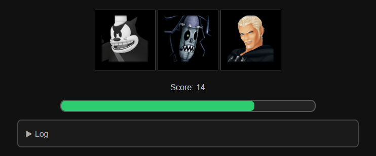

#### Fog of War

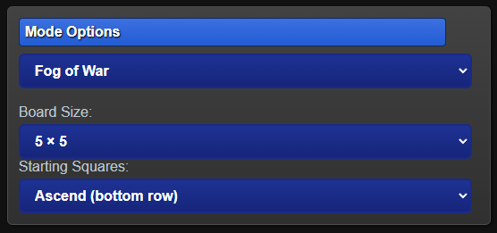

Select squares are revealed initially while the rest of the board is hidden. Complete a goal to reveal the squares to the top, bottom, left, and right.

- Score keeps track of how many goals you've completed.

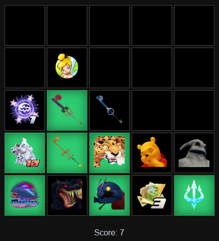

**Starting Squares Options:**

- Classic-2 picks the top left and bottom right of the center square.
- Classic-4 picks the top left, top right, bottom left, and bottom right of the center square.
- Center picks the center square only.
- Corners picks the 4 corners of the board.
- Ascend picks the bottom row of the board.
- River picks the left-most column of the board.
- Random picks a random amount and starting position of squares.
  - Minimum: 2. Maximum: Board Size.

#### Bingo

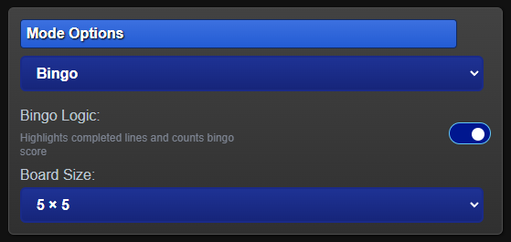

Classic Bingo Mode. Given a board, complete a line to get a bingo.

- Bingo Logic enables Bingo Line Logic
  - Squares change color when they are part of a bingo line.
  - Score keeps track of how many bingo lines you've completed.

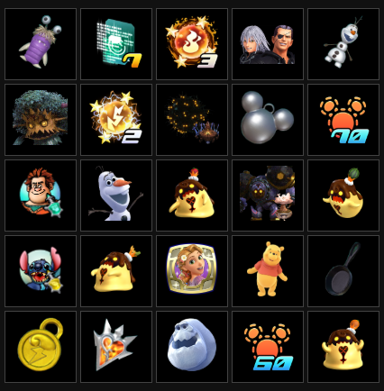

#### Roguelike

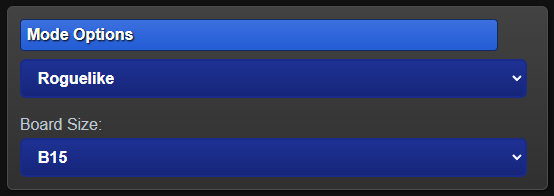

A pyramid-like board where the player starts at the top and must make their way to the bottom.

- Each layer reveals 3 squares. Complete one to move on to the next layer.
- The next layer will reveal the square directly below and the squares to the bottom left and the bottom right.
  - The left and right end squares will only reveal 2 squares.
- Red layers and the gold layer are single forced goals. The next layer will be resumed from the previous layer's position.
- Complete the gold layer to win.

Board size requirements:

- B9: 33 objectives
- B15: 82 objectives
- B20: 165 objectives

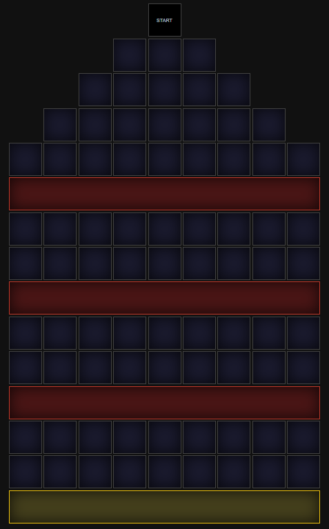

### Modifiers

#### Shiny Goals

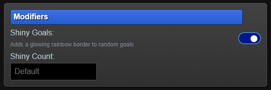

If enabled, will set random squares to "Shiny", putting a special border around goals.

- Shiny Count sets how many shiny goals show up. If left blank, a default number of shiny goals will appear.
  - Rush Mode Default = Math.floor(number of rounds / 4)
  - Fog of War and Classic Bingo Default = board size - 2
  - Roguelike Default = Math.floor(number of layers / 3)
    - they will not appear on "Red" or "Gold" layers

Based on Shiny Goals by DotoPotato: Lockout.Live

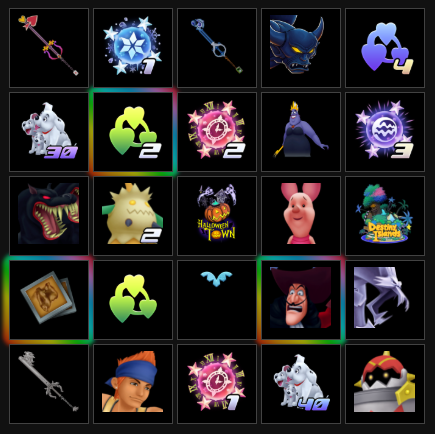

### Custom Bingo Lists

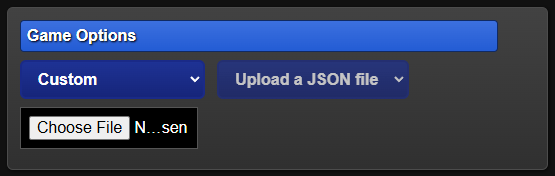

**How to use custom bingo lists:**

1. Select "Custom" for Game. A file chooser will appear.
2. Click "Choose File" and select your .json list
   - You will receive a popup message if your json file is invalid
3. Set your settings to whatever you like
4. Click the "Generate Game" button to generate a board from your goal list

**Requirements**

The .json file must be formatted as follows:

```
[
  { "name": "Objective 1" },
  { "name": "Objective 2" },
  { "name": "Objective 3" },
  { "name": "Objective 4" },
  { "name": "Objective 5" },
  { "name": "Objective 6" },
  { "name": "Objective 7" },
  { "name": "Objective 8" },
  { "name": "Objective 9" },
  { "name": "Objective 10" },
  { "name": "Objective 11" },
  { "name": "Objective 12" },
  { "name": "Objective 13" },
  { "name": "Objective 14" },
  { "name": "Objective 15" },
  { "name": "Objective 16" },
  { "name": "Objective 17" },
  { "name": "Objective 18" },
  { "name": "Objective 19" },
  { "name": "Objective 20" },
  { "name": "Objective 21" },
  { "name": "Objective 22" },
  { "name": "Objective 23" },
  { "name": "Objective 24" },
  { "name": "Objective 25" }
]
```

The list must have a "name" property for each objective. "icon" is optional. Custom icons are not supported yet, but icons already on the website are useable in custom lists. [This folder](https://github.com/CJ-2123/icon-bingo-generator/tree/main/icons) contains all of the icons on the site.

```
[
  {
    "name": "Objective 1",
    "icon": "icons/kh1-ap/Clayton.webp"
  },
  {
    "name": "Objective 2",
    "icon": "icons/kh2-bunter/ShanYu.webp"
  }
  // more goals here
]
```

## Credits

Icons from https://www.khwiki.com and https://televo.github.io/kingdom-hearts-recollection/

Based on:

- [Lockout.Live](https://beta.lockout.live/) by DotoPotato
- [Hollow Knight Exploration Bingo](https://butchie1331.github.io/hk-exploration-bingo) by butchie1331 and the Hollow Knight speedrun community
- [Breath of the Wild Bingo](https://lepelog.github.io/botw-bingo) by lepelog
- https://cj-2123.github.io/kh2-exploration-bingo/ - old KH bingo generator
